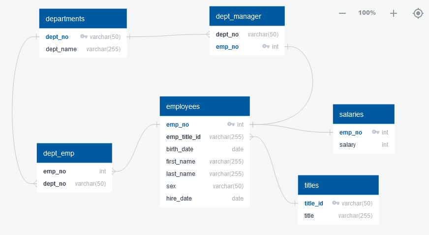

# Pewlett Hackard Employee Analysis

## Table of contents
* [Assignment](#assignment)
* [Data Sources](#data_sources)
* [Evaluation and Results](#eval_results)
* [References](#ref)

## Assignment
Research various statistics on company employees from the 1980s and 1990s.  

## Data Sources and Assumptions
Six (6) csv files contained information on employees from the requested time period, with information ranging from 7 to more than 300,000 records. 
- departments.csv
- dept_emp.csv
- dept_manager.csv
- employees.csv
- salaries.csv
- titles.csv

Link to data sources: https://github.com/KLacerda08/sql-challenge/tree/main/EmployeeSQL/Resources 

The dataset included information for 13 employees hired during January 2000.  For the purposes of this assignment, and given that these 13 employees
represent a small fraction (<<0.01%) of the employees in the dataset, these records were included in the evaluation.  However, the analysis could be 
further refined to focus only on those employees from the 1980s and 1990s, if needed.  

## Evaluation and Results
The csv files were inspected to gather information regarding headings/fields and delimeters.  An entity relationship diagram (ERD) was prepared
to illustrate the appropriate connections between the data tables.  Primary and foreign keys were assigned to serve as unique record identifiers. 

The following employee statistics were queried: 

1. List the employee number, last name, first name, gender, and salary.  A total of 300024 rows were returned, indicating the total number 
   of employees in the database.  

2. List the first name, last name, and hire date for employees who were hired in 1986. The analysis indicated that a total of 36,150 employees 
   were hired that year.  

3. List the manager of each department with the following information: department number, department name, the manager's employee number, 
   last name, and first name.  These attributes were returned for the 24 department managers. 

4. List the department of each employee with the following information: employee number, last name, first name, and department name. A total of 
   331,603 records were returned, indicating that 31,579 employees worked in more than one department.  

5. List first name, last name, and gender for employees whose first name is "Hercules" and last names begin with "B." Twenty (20) employees
   fit these parameters.

6. List all employees in the Sales department, including their employee number, last name, first name, and department name. There were 52,245 
   employees in the Sales department.  

7. List all employees in the Sales and Development departments, with the same attributes as item 6 above:  137,952 employees were in the Sales and  
   Development departments.

8. In descending order, list the frequency count of employee last names, i.e., how many employees share each last name.  There were 1638 unique 
   last names, with up to 226 people sharing the same last name.  

Based on the analysis, an uncommonly high number of people share last names, and/or have names that are relatively uncommon to the general 
population (e.g. "Hercules").  Additionally, the number of department managers (24) seems very low for the number of overall employees (300,024).
These results should be viewed with some scrutiny and may benefit from additonal analysis.  

## References
1. image source: https://plandisc.com/en/hr-cycle-calendar/ 